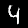
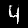
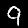
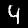
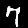
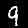
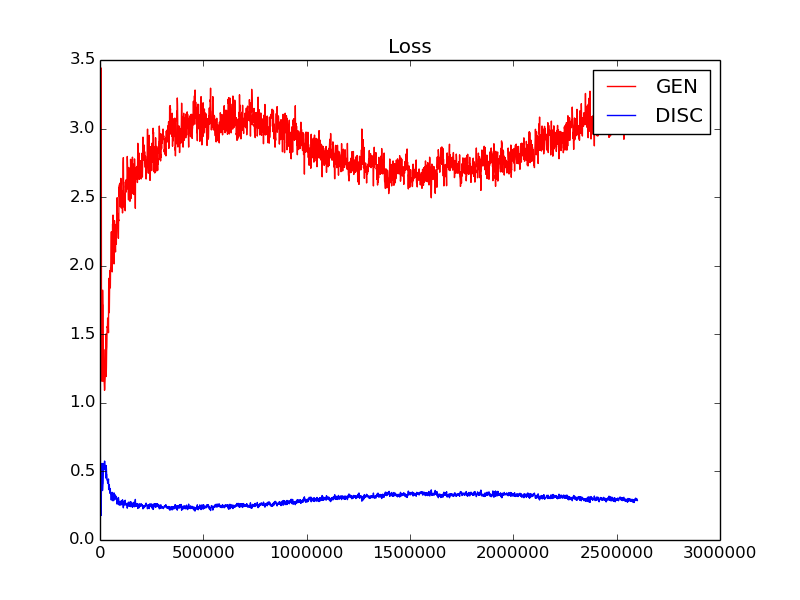
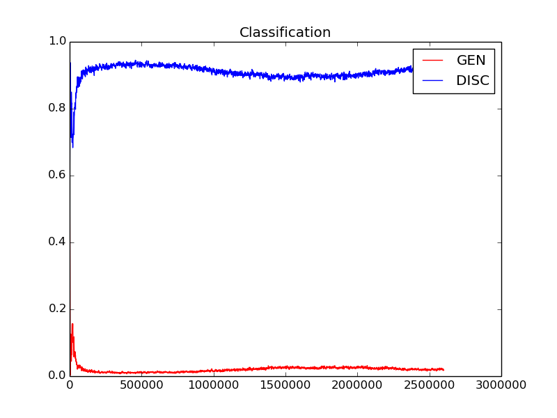
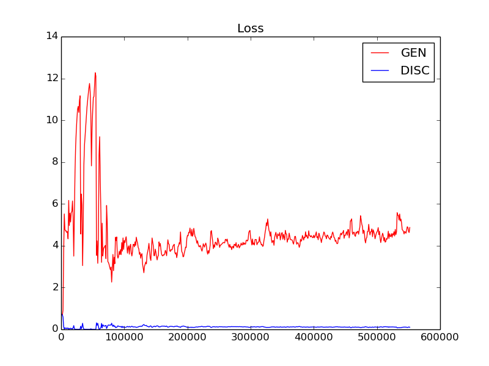
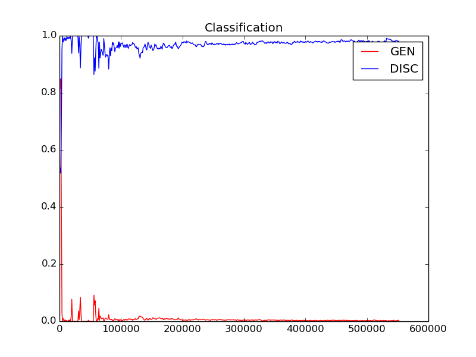

# LSTM-GAN-MNIST

## Link to the paper, visit: [Link](https://link.springer.com/chapter/10.1007/978-981-13-1610-4_11)

## To easily cite our Paper, visit : [Link](https://link.springer.com/chapter/10.1007/978-981-13-1610-4_11#citeas)

## Brief description: 

Using the MNIST set to experiment with GANs using LSTM's 

Model
=====
Following a generic generative adversarial network, the model consists two networks trained in parallel, and sharing weights.
The pink portion of the model is the generator and the orange-brown portion is the discriminator. For purposes of clarity the image is
split into quadrants here, but in other experiments the attempt was to split the image into pixels in an attempt to create a 
generator that could create digits pixel by pixel using long range memory. Up to now the best results have occurred with splitting
the image into 16 sections, beyond that the model fails.

Generator
---------

Discriminator
---------

Experiments
=====

### TIMESTEP MODEL

| Variable          | Value     |
| :---------------- | :---------|
| timesteps         | 4         |
| lstm_layers_RNN_g | 6        |
| lstm_layers_RNN_d | 2         |
| hidden_size_RNN_g | 600       |
| hidden_size_RNN_d | 400       |
| lr                | 1e-4    |
| iterations        | > 2.5e6       |

#### SAMPLES

|0|1|2|3|4|5|6|7|8|9|
|:---|:---|:---|:---|:---|:---|:---|:---|:---|:---|
|||||||||||
|||||||||||
|||||||||||
|||||||||||
|||||||||||
|||||||||||
|||||||||||
|||||||||||
|||||||||||
|||||||||||

### TIMESTEP MODEL

| Variable          | Value     |
| :---------------- | :---------|
| timesteps         | 16         |
| lstm_layers_RNN_g | 6        |
| lstm_layers_RNN_d | 2         |
| hidden_size_RNN_g | 600       |
| hidden_size_RNN_d | 400       |
| lr                | 2e-4:GEN/1e-4:DISC    |
| iterations        | > 5e5       |

#### SAMPLES

|0|1|2|3|4|5|6|7|8|9|
|:---|:---|:---|:---|:---|:---|:---|:---|:---|:---|
|||||||||||
|||||||||||
|||||||||||
|||||||||||
|||||||||||
|||||||||||
|||||||||||
|||||||||||
|||||||||||
|||||||||||

